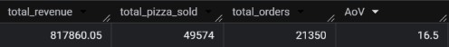
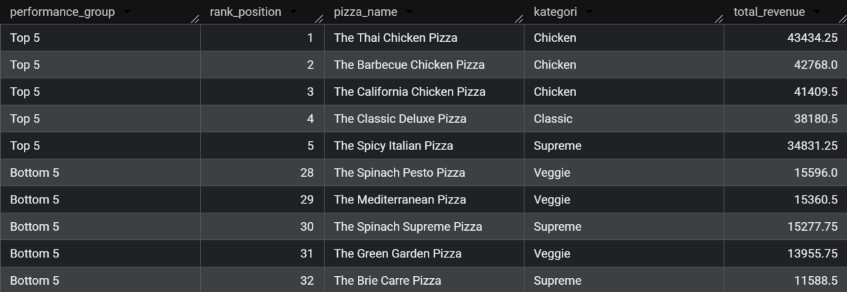
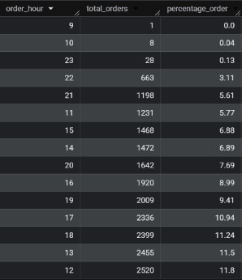
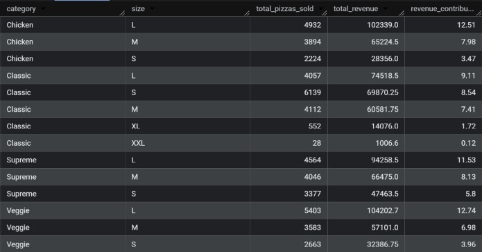
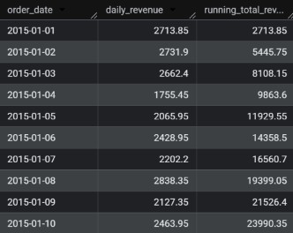

# 📊 Pizza Sales Quick Analysis using Google BigQuery

## 🔍 Overview
melihat data transaksi tahun 2015 ini masih berupa data mentah. Untuk menyusun strategi promosi, efisiensi operasional dapur, dan optimalisasi menu kuartal depan, saya butuh bantuan untuk melakukan beberapa analisis berikut:
1. Angka ringkasan cepat untuk rapat direksi: Berapa total pendapatan kotor (gross revenue), total pizza yang berhasil terjual, total transaksi (order), dan berapa rata-rata nilai belanja pelanggan per transaksi (Average Order Value / AOV).
2. Petakan 5 menu pizza teratas (top 5) dan 5 menu pizza terbawah (bottom 5) berdasarkan total revenue yang dihasilkan.
3. Analisakan tren volume pesanan berdasarkan jam dalam sehari (hour of day). Jam berapa saja yang merupakan jam tersibuk (rush hours).
4. Breakdown total penjualan dan kontribusi pendapatan (persentase dari total revenue) berdasarkan kategori pizza (category) dan ukuran pizza (size).
5. Laju pertumbuhan pendapatan kumulatif dari hari ke hari sepanjang tahun berjalan untuk melihat kestabilan cash flow.

## 📝 Result
### 1. KPI Summary

### 2. 5 Menu Teratas dan Terbawah

### 3. Volume Penjualan per Jam

### 4. Revenue per Kategori dan Ukuran

### 5. Pertumbungan Pendapatan Kumulatif

## ⚡Quick Business Insight
- Peak Hours terjadi sekitar jam makan siang (12.00-13.00) dan sepulang kerja (17.00-19.00) untuk itu ada baiknya untuk menyesuaikan jumlah karyawan dan menyiapkan bahan-bahan sebelum jam tersebut tiba agar proses pelayanan bisa lebih efektif.
- Bottom 5 menu masuk ke kategori Veggie & Supreme. Melihat dari data peak hour yang menunjukkan bahwa kedai lebih ramai saat jam makan siang dan sepulang kerja, alangkah baiknya dilakukan analisa lebih lanjut apakah ada kemungkinan kurang suka dengan pizza yang terlalu banyak sayuran atau pizza yang mahal.
